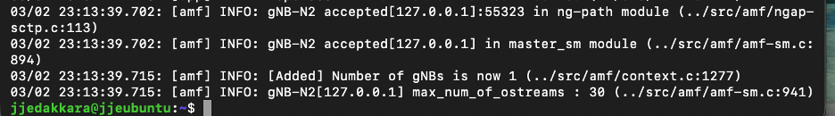
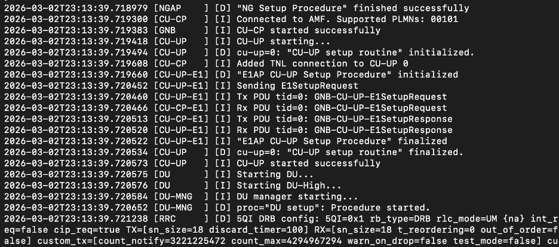
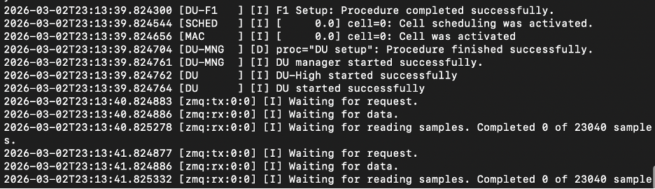
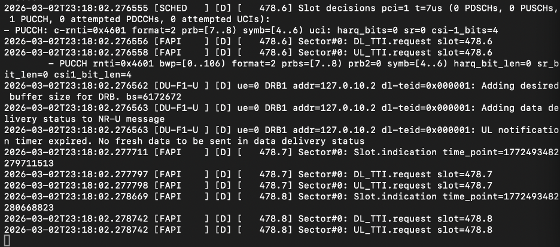
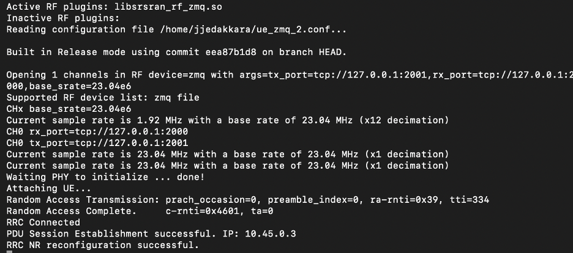
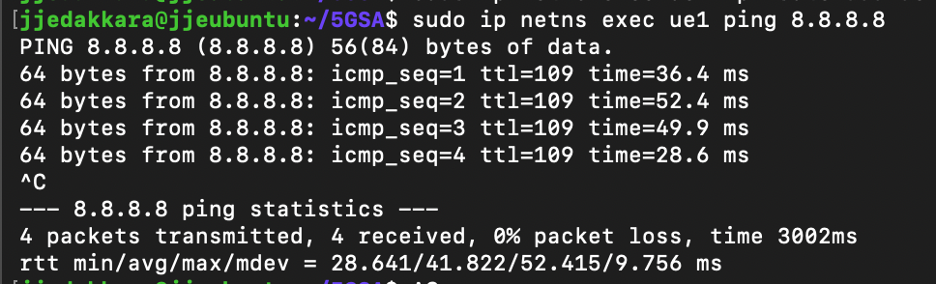

### 🛠️ Built With
- **OS:** Ubuntu 22.04 LTS
- **Open5GS:** v2.7.6
- **srsRAN/OCUDU Project (gNB):** v25.10.0
- **srsRAN 4G (UE):** v23.4.0
- **ZMQ:** libzmq3-dev

## ## 🛠️ Installation Guide

### 1. Install System Dependencies
OCUDU requires specific libraries for the 3GPP stack and O-RAN processing:
sudo apt-get update
sudo apt-get install -y cmake make gcc g++ pkg-config libfftw3-dev \
libmbedtls-dev libsctp-dev libyaml-cpp-dev libgtest-dev libzmq3-dev

git clone [https://gitlab.com/ocudu/ocudu.git](https://gitlab.com/ocudu/ocudu.git)
cd ocudu
mkdir build && cd build
cmake ../ -DENABLE_ZEROMQ=ON
make -j$(nproc)

sudo add-apt-repository ppa:open5gs/latest
sudo apt update
sudo apt install open5gs

## ## 📊 Simulation Results

### 1. Core & RAN Connection
The OCUDU gNB successfully establishes an NGAP connection with the Open5GS AMF:

### 2. UE Registration
The srsUE successfully attaches to the network and is assigned an IP address:

### 3. End-to-End Data Test
A successful ping test through the `tun0` interface confirms the user plane is operational:

